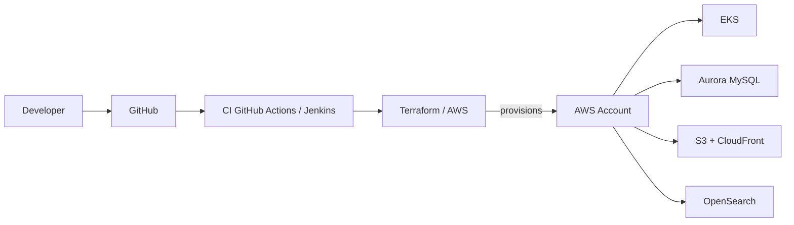

<- [Day 00](docs/advanced-bootcamp/00-day-setup/README.md) - [Day 01](/docs/advanced-bootcamp/01-day/README.md) ->

# Day 0: Repository planning, architecture definition, and cost awareness.

## Todo
- [x] Repository structure setup
- [x] Architecture diagram added
- [x] Destroy policy documented
- [x] Cost estimation proposed

### 1. Architecture

### 2. Destoy Policy

> [!WARNING]
> Always destroy sandbox resoucres after use.
> **Rules**
> - Sandbox infrastructure is temporary
> - No long-lived resources are allowed
> - Terraform `destroy` is mandatory after each exercise

### Tags

| Key | Value |
|--------|-------------|
| project | aw-bootcamp |
| env | sandbox |

### 3. Cost Estimation

Cost estimation is documented in:
- `./assets/cost-estimation.csv`
- `./assets/cost-estimation.pdf`

- using: https://calculator.aws
